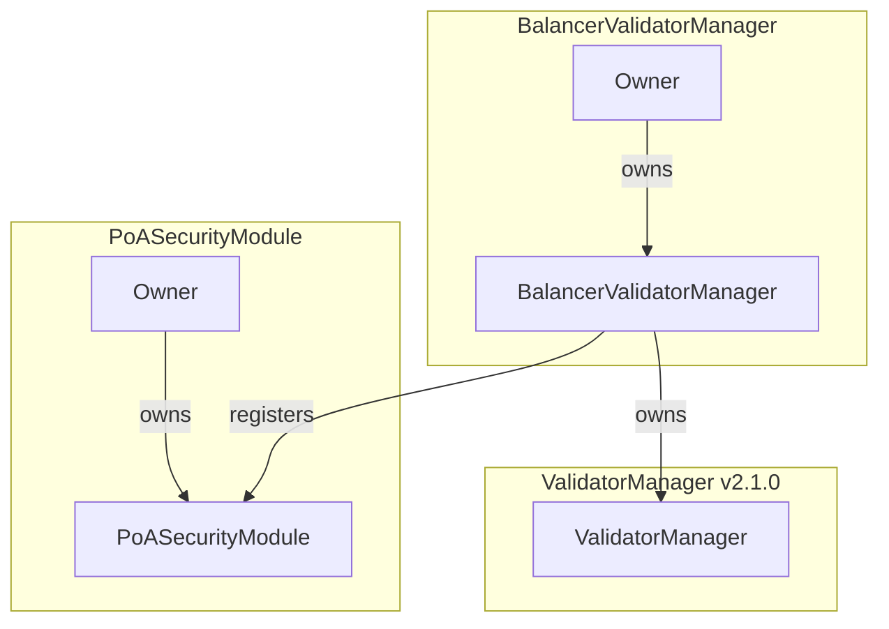

# Balancer Validator Manager

The `BalancerValidatorManager` contract wraps the ICM `ValidatorManager` (v2.1.0) and implements a validator management system that allows multiple security modules to control portions of the validator set. Each security module is allocated a maximum weight they can assign to their validators.

The `BalancerValidatorManager` also adds useful getters for the underlying `ValidatorManager` contract state.

## Key Features

- Multiple security modules can operate independently to manage validators
- Each security module has a maximum weight allocation they cannot exceed
- Tracks and enforces security module weight limits
- Supports wrapping existing ValidatorManagers that already have validators
- Enforces validator ownership by security modules

## Key Functions

### Security Module Management

- `setUpSecurityModule`: register a new security module with a maximum weight allocation
- `getSecurityModules`: get the list of registered security modules
- `getSecurityModuleWeights`: get the current weight and maximum weight allocation for a module

### Validator Management

New functions in `BalancerValidatorManager`:

- `initiateValidatorRegistration`: begin validator registration process with security module weight tracking
- `initiateValidatorRemoval`: begin validator removal process with security module weight updates
- `initiateValidatorWeightUpdate`: begin validator weight update process with security module weight tracking
- `completeValidatorRegistration`: complete validator registration process (security module restricted)
- `completeValidatorRemoval`: complete validator removal process (security module restricted)
- `completeValidatorWeightUpdate`: complete validator weight update process (security module restricted)
- `resendValidatorWeightUpdate(validationID)`: permissionless resend of the latest weight message. Used only when `sentNonce > receivedNonce` and validator is Active. Preserves liveness without consuming churn or bumping nonce

Functions inherited from `ValidatorManager`:

- `initializeValidatorSet`: initialize the validator set with conversion data
- `resendRegisterValidatorMessage`: resend validator registration message
- `resendValidatorRemovalMessage`: resend validator removal message
- `migrateFromV1`: pass-through to ValidatorManager's internal storage migration function (permissionless)
- `transferValidatorManagerOwnership`: transfer ownership of the underlying ValidatorManager

### Getters

New functions in `BalancerValidatorManager`:

- `getSecurityModules`: get the list of registered security modules
- `getSecurityModuleWeights`: get the current weight and maximum weight allocation for a module
- `getValidatorSecurityModule`: get the security module that owns a specific validator
- `isValidatorPendingWeightUpdate`: check if validator has pending weight update
- `getChurnPeriodSeconds`: get the churn period duration
- `getMaximumChurnPercentage`: get the maximum allowed churn percentage
- `getCurrentChurnPeriod`: get the current churn period details

Functions inherited from `ValidatorManager`:

- `getValidator`: get the validator details
- `getNodeValidationID`: get the validation ID for a node ID
- `l1TotalWeight`: get the total weight of all validators
- `subnetID`: get the subnet ID

## Usage

Security modules must implement the `ISecurityModule` interface and support ERC-165 interface detection to interact with the BalancerValidatorManager. The contract owner can register security modules and set their maximum weight allocations.

Each security module can then independently manage their validator set within their weight limits, while the underlying `ValidatorManager` functionality ensures overall system stability and churn rate compliance.

For PoA-based validator management, deploy a `PoASecurityModule` instance and register it with the `BalancerValidatorManager`. The owner of the PoA module can then manage validators within their allocated weight limit.

### Architecture

The BalancerValidatorManager acts as a wrapper around the ICM ValidatorManager contract:

- The BalancerValidatorManager owns the underlying ValidatorManager
- Security modules interact with the BalancerValidatorManager, not directly with the ValidatorManager
- All validator operations are tracked and attributed to their managing security module
- Weight limits are enforced at the BalancerValidatorManager level



### Migration Support

When wrapping an existing ValidatorManager that already has active validators, the BalancerValidatorManager requires you to assign those validators to a security module during initialization:

- Provide an initial security module address to own the existing validators
- List all validator node IDs in the `migratedValidators` array
- The total weight of migrated validators must match exactly

## Security Modules

### PoA Security Module

The `PoASecurityModule` is an implementation of a security module that provides Proof of Authority (PoA) style validator management.

#### Key Characteristics:

- **Owner-controlled validator management**: Inherits from OpenZeppelin's `Ownable` for access control
- **Immutable BalancerValidatorManager reference**: Stores the BalancerValidatorManager address as an immutable variable
- **Delegates all operations**: Acts as a proxy, forwarding all calls to the BalancerValidatorManager
- **ERC-165 support**: Inherits from `ERC165` and implements the `ISecurityModule` interface
- **Zero address validation**: Reverts with `ZeroAddress()` error if deployed with invalid addresses

#### Constructor:

```solidity
constructor(
    address balancerValidatorManagerAddress,
    address initialOwner
)
```

- `balancerValidatorManagerAddress`: The BalancerValidatorManager contract to interact with
- `initialOwner`: The address that will have exclusive control over validator operations

#### Key Functions:

**Owner-restricted functions (initiation):**

- `initiateValidatorRegistration(nodeID, blsPublicKey, remainingBalanceOwner, disableOwner, weight)`: Registers new validators with P-Chain owners. Returns `validationID`
- `initiateValidatorRemoval(validationID)`: Removes validators by their validation ID
- `initiateValidatorWeightUpdate(validationID, newWeight)`: Updates validator weights. Returns `nonce` and `messageID`

**Permissionless functions (completion):**

- `completeValidatorRegistration(messageIndex)`: Returns `validationID`
- `completeValidatorRemoval(messageIndex)`: Returns `validationID`
- `completeValidatorWeightUpdate(messageIndex)`: Returns `validationID` and `nonce`

This design ensures that only the owner can initiate validator changes, but anyone can complete the operations once they're acknowledged by the P-Chain, improving system liveness and preventing stuck states.
